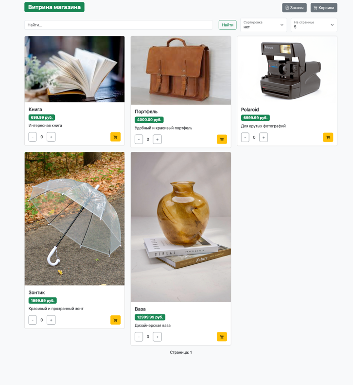
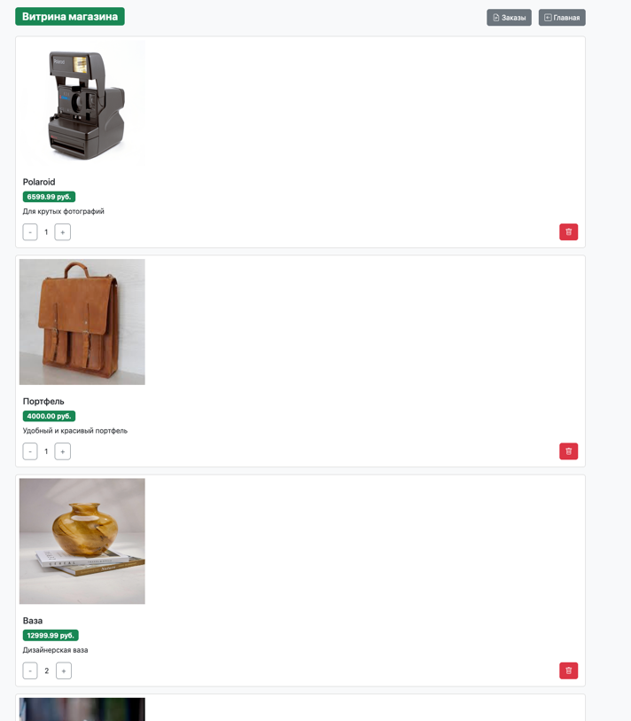
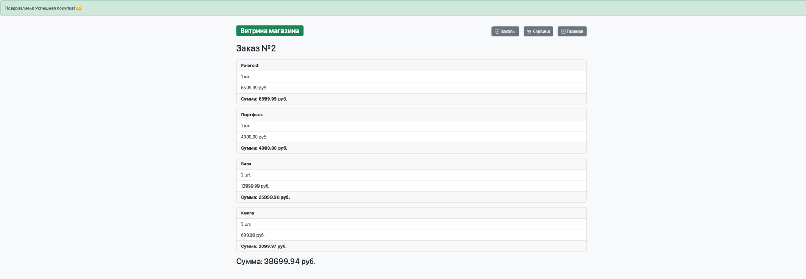

# Описание проекта

Данное приложение представляет из себя интернет магазин с возможностью добавлять товары в корзину, изменять их 
количество и создавать закаказы из добавленных в корзину товаров, написанное на реактивном стеке.

## Скриншоты:
Витрина:

Корзина:

Заказы:


# Сборка приложения
В тестах используется зависимость `TestContainers`, поэтому для корректного тестирования обязетльно необходимо иметь
установленный `Docker`. Без него не поднимуться тестовые контейнеры.

Для тестирования выполните:
```shell
mvnw test
```

Проект можно собрать как в исполняемый `jar` файл, так и сформировать `Docker` образ.

Для формирования исполняемого `jar` выполните:
```shell
mvnw clean package
```

Для формирование `Docker` необходимо выполнить ряд шагов.
Поскольку в проекте используется `TestContainers`, тесты удобнее вызывать **до** сборки. Выполните:
```shell
mvnw clean test
```
для сборки образа `Docker` выполните:
```shell
docker built -t market_app .
```
# Запуск приложения

## Запуск исполняемого `jar`
Для того, чтобы запустить приложение, независимо от варианта сборки, необходимо иметь базу данных `postgresql`.

Для того, чтобы запустить приложение, если **используется исполняемый `jar`**, необходимо поместить в переменные 
окружения:
- `DB_USERNAME` - имя пользователя БД
- `DB_PASSWORD` - пароль пользователя БД
- `R2DBC_DB_URL` - url реактивного доступа к БД
- `JDBC_DB_URL` - url для блокирующего доступа к БД

Рактиыный url используется в самом приложении как основной. Блокирующий нужен для корректной работы миграции базы данных, его использует `liquebase`.

И выполнить команду
```shell
 java -jar app.jar
```

Если вы не добавляли своих собственных продуктов для витрины, можете воспользоваться тестовым заполнением для 
ознакомления, выплонив запуск с профилем `TEST_DATA`.
```shell
java -jar --spring.profiles.active=TEST_DATA app.jar
```

## Запуск в `Docker`

### Независимо
Для того, чтобы запустить `Docker` контейнер с приложением необходимо выполнить:
```shell
docker run -d --name app -e DB_USERNAME=имя_пользователя_бд -e DB_PASSWORD=пароль -e R2DBC_DB_URL=реактивный_url -e JDBC_DB_URL=блокирующий_url -p внешний_порт:8080 market-app
```
заменив соответствующие переменные окружения.

Чтобы выполнить запуск с профилем необходимо выоплнить:
```shell
docker run -d --name app -e SPRING_PROFILES_ACTIVE=TEST_DATA -e DB_USERNAME=имя_пользователя_бд -e DB_PASSWORD=пароль -e R2DBC_DB_URL=реактивный_url -e JDBC_DB_URL=блокирующий_url -p внешний_порт:8080 market-app
```
Учтите, что в данном случае вам придется дополнительно пробросить порты от базы данных к контейнеру приложения, если они
запущены независимо (БД не в контейнере или не используется docker-сеть между ними).

### Только контейнеры
В случае, если испльзуется контейнер с базой данных, необходимо создаь сеть, через которую приложение получиьт доступ к БД:
```shell
docker network create имя_сети
```

Для того, чтобы запустить контейнер с базой данных необхоидмо выполнить:
```shell
docker run -d --name db --network имя_сети -e POSTGRES_DB=имя_бд -e POSTGRES_USER=имя_пользователя -e POSTGRES_PASSWORD=пароль postgres:15
```

Затем можно запустить контейнер с приложением:
```shell
docker run -d --name имя_контейнера --network имя_сети -e SPRING_PROFILES_ACTIVE=TEST_DATA -e DB_PASSWORD=пароль -e DB_USERNAME=имя_пользователя -e R2DBC_DB_URL=реактивный_url_к_бд -e JDBC_DB_URL=блокирующий_url_к_БД -p 8080:8080 имя_контейнера 
```
# Итог
Если все было сделано верно, приложение будет запущено на `localhost:8080/`

## Добавление своих товаров
Если вам необходимо добавить свои товары, разместите их картинки в `/resources/static`, и добавить в базу данных запись в таблицу `products`