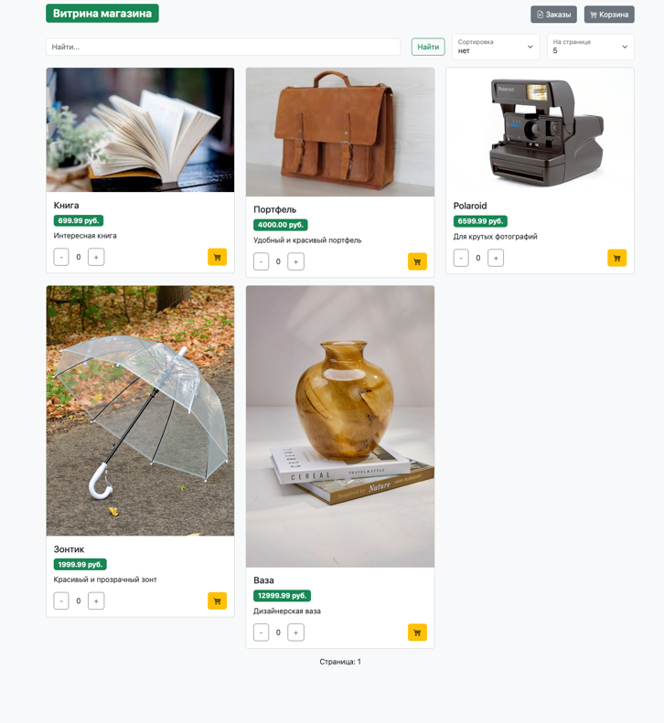
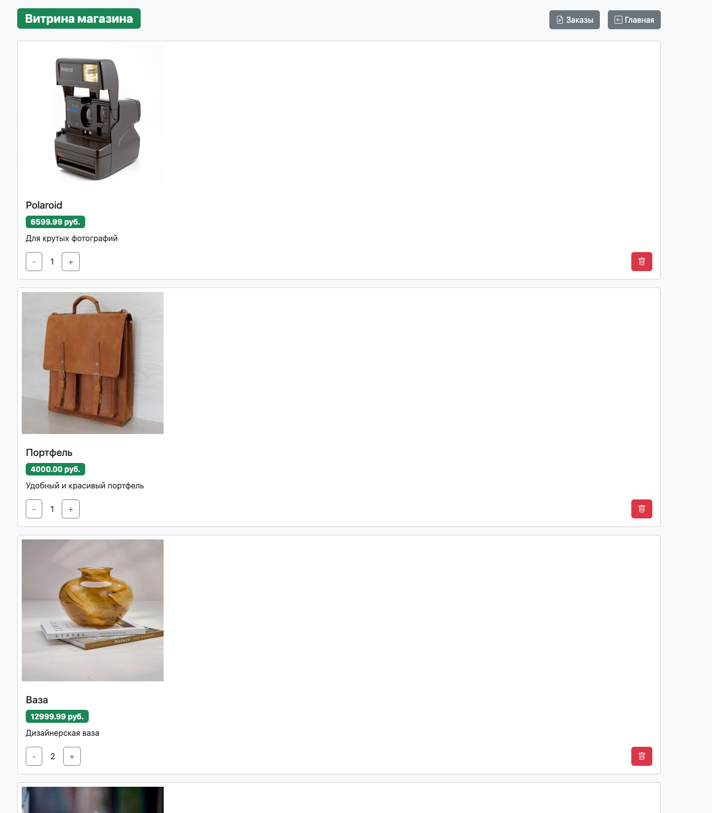
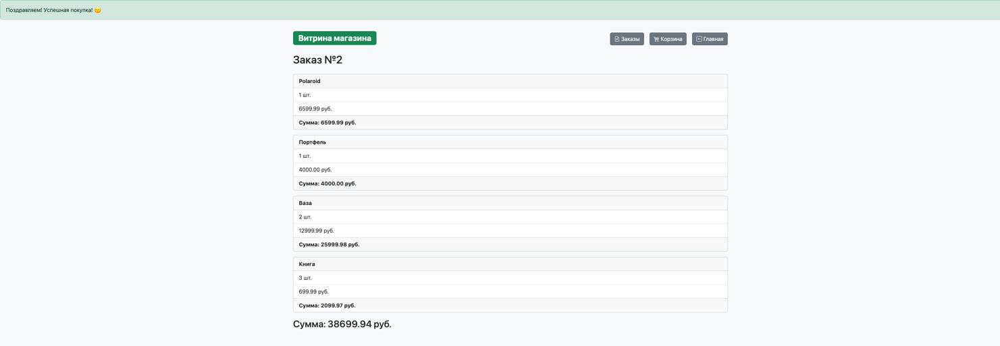
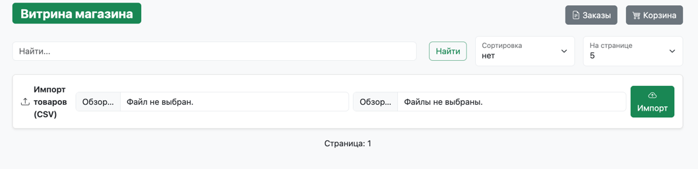
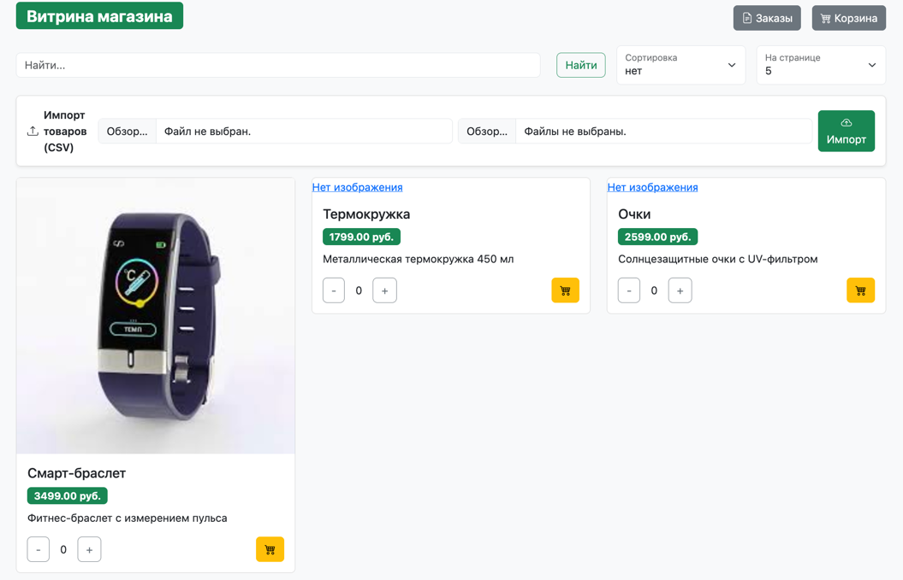

# Описание проекта

Данное приложение представляет из себя интернет магазин с возможностью добавлять товары в корзину, изменять их 
количество и создавать закаказы из добавленных в корзину товаров, написанное на реактивном стеке с поддержкой
кеширования товаров с использованием Redis. В отдельный модуль вынесен сервис платежей

## Скриншоты:
Витрина:

Корзина:

Заказы:


# Общая информация
Для работы проекта необходимо иметь поднятный Redis, PostgreSQL. 
Сам проект разделен на два модуля: 
1. Сервис платежей 
1. 2. Витрина магазина

# Сборка приложения
В тестах используется зависимость `TestContainers`, поэтому для корректного тестирования обязетльно необходимо иметь
установленный `Docker`. Без него не поднимуться тестовые контейнеры.

Для тестирования всех модулей выполните:
```shell
mvnw test
```

Проект можно собрать как в исполняемые `jar` файлы, так и сформировать `Docker` образы. Также присутствует поддержка
docker-compose.

Для формирования исполняемых `jar` выполните:
```shell
mvnw clean package
```

Для формирования `Docker` образов необходимо выполнить ряд шагов.
Поскольку в проекте используется `TestContainers`, тесты необходимо вызывать **до** сборки. Выполните:
```shell
mvnw clean test
```
для сборки образа `Docker` выполните из корня проекта:
```shell
docker build -t showcase -f showcase/Dockerfile .
docker build -t paymentservice: -f paymentservice/Dockerfile .
```
# Запуск приложения

## Запуск исполняемого `jar`
Для того, чтобы запустить витрину, независимо от варианта сборки, необходимо иметь базу данных `postgresql` и `redis`.

Для того, чтобы запустить витрину, если **используется исполняемый `jar`**, необходимо поместить в переменные 
окружения:
- `DB_USERNAME` - имя пользователя БД
- `DB_PASSWORD` - пароль пользователя БД
- `R2DBC_DB_URL` - url реактивного доступа к БД
- `JDBC_DB_URL` - url для блокирующего доступа к БД
- `IMAGES_DIR` - папка, где будут храниться изображения. Обратите внимание, что вам необходимо создать ее самостоятельно и удостовериться в наличии прав для записи.
- `REDIS_IP` - IP адрес Redis
- `REDIS_PORT` - порт Redis
- `PAYMENT_SERVICE_URL` - url адрес сервиса платежей

Для того, чтобы запустить сервис платежей, если **используется исполняемый `jar`**, необходимо поместить в переменные
окружения:
- `DB_USERNAME` - имя пользователя БД
- `DB_PASSWORD` - пароль пользователя БД
- `R2DBC_DB_URL` - url реактивного доступа к БД
- `JDBC_DB_URL` - url для блокирующего доступа к БД

Рактиыный url используется в самом приложении как основной. Блокирующий нужен для корректной работы миграции базы данных, его использует `liquebase`.

И выполнить команды
```shell
 java -jar имя_сервис.jar
```

После запуска приложение по умолчанию не содержит данных.

Для того, чтобы добавить их необходимо импортировать `.csv` файл с данными товаров и `.png` изображения товаров.

Обратите внимание, что импорт изображений не обязателен.
Пример `.csv` файла:
```csv
title,description,imageName,price
Смарт-браслет,Фитнес-браслет с измерением пульса,band.png,3499.00
```

Если вы не хотите добавлять своих собственных продуктов для витрины, можете воспользоваться тестовым заполнением для 
ознакомления, выплонив запуск с профилем `TEST_DATA`.
```shell
java -jar --spring.profiles.active=TEST_DATA витрина_магазина.jar
```

## Запуск в `Docker`

### Независимо
Для того, чтобы запустить `Docker` контейнер с витриной необходимо выполнить:
```shell
docker run -d --name showcase -e DB_USERNAME=имя_пользователя_бд -e DB_PASSWORD=пароль -e R2DBC_DB_URL=реактивный_url -e JDBC_DB_URL=блокирующий_url -e IMAGES_DIR=папка_для_картинок -e REDIS_IP=ip_redis -e REDIS_PORT=порт_redis -e PAYMENT_SERVICE_URL=url_сервиса платежей -p внешний_порт:8080 showcase-app
```
заменив соответствующие переменные окружения.

Чтобы выполнить запуск с профилем необходимо выоплнить:
```shell
docker run -d --name showcase -e SPRING_PROFILES_ACTIVE=TEST_DATA -e DB_USERNAME=имя_пользователя_бд -e DB_PASSWORD=пароль -e R2DBC_DB_URL=реактивный_url -e JDBC_DB_URL=блокирующий_url -e IMAGES_DIR=папка_для_картинок -e REDIS_IP=ip_redis -e REDIS_PORT=порт_redis -e PAYMENT_SERVICE_URL=url_сервиса платежей -p внешний_порт:8080 showcase-app
```

Для запуска сервиса платежей:
```shell
docker run -d --name showcase -e DB_USERNAME=имя_пользователя_бд -e DB_PASSWORD=пароль -e R2DBC_DB_URL=реактивный_url -e JDBC_DB_URL=блокирующий_url -p внешний_порт:8090 showcase-app
```

Учтите, что в данном случае вам придется дополнительно пробросить порты от баз данных к контейнеру приложения, если они
запущены независимо (БД не в контейнере или не используется docker-сеть между ними). Если же используется docker-контейнер,
то вам необходимо настроить сеть между ними

### Только контейнеры
Приложение поддерживает запуск через docker-compose.
Для этого в корн проекта выполните
```shell
docker compose --env-file environments.env up
```
В файле `environments.env` определены переменные окружения, которые используются в `Docker` контейнерах. Если вы хотите что-то поменять, то нужно менять именно этот файл.
Например, если вы хотите использовать тестовые данные, то можете поменять профиль:
```env
SPRING_PROFILES_ACTIVE=TEST_DATA
```
Когда контейнер будет запущен, он заполнит тестовые данные в БД и подготовит необходимые картинки.

# Итог
Если все было сделано верно, приложение будет запущено на `localhost:8080/`
Сервис платежей будет работать на `localhost:8090/`

При этом, если сервис платежей будет не доступен, или баланс не будет удовлятворять требованиям - покупка будет невозможна
